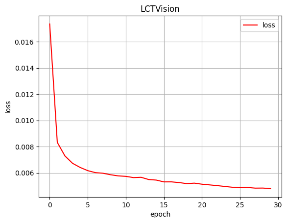

LCTVLM (Laten Connected Model Visual Language Model )
-------------------------------------
LCT is a new transformer variant look Attention  by two preception with linear layers step1 + step2 
passing to sparately GELU function and smoothing by linear layers passing to Tanh function 
for smoothing outputs.. after all do residural connection with input and then create a increased attention Result. 

LCTVLM is how our try make Visual Language model basicly by LCT Model, LCTVLM Encoder + QFormer + LMLCT. 

LCVLM Encoder:
-------------------------


LCVLM Encoder is Visual Encoder for LCTVLM understanding image representation with learning 
how to recontruction noicing image to cleaning image. 
LCVLM Train similiar Diffusion model when model training by self supervised learning by noiced image as input and clean image as output. 

LCVLM Encoder train by Flickr8K datasets with MSE function as loss function, Adam as optimizers and here is model bechmark:



this bechmark train by spesific model:
embedding_dim and d_model: 256 \n 
Global_FFN: (1024,256) \n
ConvTranspose2D: (128,64,64) \n
num_LCT_block: 3 

model_size: 8.6 mb \n 

how to use mode:
bash
```
    from  lctvlm import *
    model =  PretrainedVIT(
    image_size=224,
    patch_size=8,
    embdding_dim=256,
    n_block=3
    )
    checkpoint = torch.load(path_model)
    model.load_state_dict(checkpoint)
```

note: LCTVLM is still not finish to create, QFormers and LMLCT will update soon
